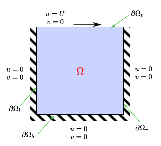

# HPC Lid Driven Cavity Coursework 2024

Parallel implementation of a lid driven cavity fluid solver with MPI and OpenMP. Written by Stephen Liu.

## Table of Contents

- [Overview](#Overview)
- [Project Structure](#project-structure)
- [Installation](#Installation)
- [Running the Code](#Running-the-Code)

## Overview

As part of the HPC coursework, a serial lid driven cavity solver is parallelised with MPI and OpenMP. The problem to be solved is seen in Figure 1. The flow properties in the cavity at any time t is desired and must be computed via the 2D Navier-Stokes equation, which can be solved via discretised streamfunction and vorticity. A grid discretisation, in the form of a second-order central differencing equation, is generated, as seen in Figure 2. A preconditioned conjugate solver is used to solve the spatial aspect of the 2D Navier-Stokes equation. The time-domain aspect of the problem is then also solved by a five point stencil. By sequentially solving the spatial and time problem, the flow properties at any time t can be computed. A detailed discussion of the theoretical framework that is implemented can be found [here](other/assignment.pdf).

<table>
  <tr>
    <td>
        
        <p>Figure 1: Lid driven cavity domain</p>
    </td>
    <td>
        
        <p>Figure 2: Lid driven cavity discretised domain</p>
    </td>
  </tr>
</table>

## Project Structure

Source files for generating the code as well as the unit tests are found immediately. The test directory holds reference datasets for testing purposes and should be left untouched, while other directory holds support documents and images for documentation purposes.

## Installation

The submission provides all the source code. The following libraries are used and should therefore be installed

 - OpenMP
 - MPI (with mpiexec wrapper)
 - BLAS (cblas wrapper)
 - Boost::program_options

## Running the Code

It is recommended to generate the documentation first using <code><span style="color: red;">make doc</span></code>. To obtain the exectuable ./solver, run <code><span style="color: red;">make</span></code>  to compile the project. Unit tests can be generated with <code><span style="color: red;">make unittests </span></code> and will generate the ./unittests executable. To clean up the directory, use <code><span style="color: red;">make clean</span></code>.

This code uses both OpenMP and MPI to parallelise the code. To control the number of threads, the environment variable OMP_NUM_THREADS should be set beforehand and number of processors set via -np. --bind-to none is recommended to prevent threads competing for the same core.

```bash
$ export OMP_NUM_THREADS=1
$ mpiexec --bind-to none -np 1 ./solver --help
    Solver for the 2D lid-driven cavity incompressible flow problem:
  --Lx arg (=1)         Length of the domain in the x-direction.
  --Ly arg (=1)         Length of the domain in the y-direction.
  --Nx arg (=9)         Number of grid points in x-direction.
  --Ny arg (=9)         Number of grid points in y-direction.
  --dt arg (=0.01)      Time step size.
  --T arg (=1)          Final time.
  --Re arg (=10)        Reynolds number.
  --verbose             Be more verbose.
  --help                Print help message.
```

An example program execution is shown below, with initial data written into ic.txt and final data written into final.txt.

```bash

$ export OMP_NUM_THREADS=1

$ mpiexec --bind-to none -np 1 ./solver --Lx 1 --Ly 1 --Nx 201 --Ny 201 --Re 1000 --dt 0.005 --T 1

  Grid size: 201 x 201
  Spacing:   0.005 x 0.005
  Length:    1 x 1
  Grid pts:  40401
  Timestep:  0.005
  Steps:     200
  Reynolds number: 1000
  Linear solver: preconditioned conjugate gradient

  Reynolds number: 1000
  Linear solver: preconditioned conjugate gradient

  Writing file ic.txt
  Step:        0  Time:        0
  Converged in 567 iterations. eps = 9.50342e-07
  Step:        1  Time:    0.005
  Converged in 597 iterations. eps = 9.91513e-07
  Step:        2  Time:     0.01
  Converged in 590 iterations. eps = 9.32345e-07

...

  Step:      198  Time:     0.99
  Converged in 570 iterations. eps = 9.65645e-07
  Step:      199  Time:    0.995
  Converged in 570 iterations. eps = 9.64797e-07
  Writing file final.txt

```
